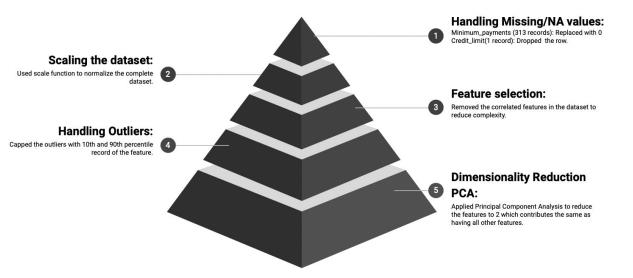

## Introduction

Nowadays, credit cards are the most used tool to pay for services and foods and also to borrow money, and make big purchases using EMI (Equated Monthly Installment), and are also useful in emergency situations. The Motivation behind performing the credit card customer segmentation is that the financial institutions can optimize the marketing strategy based on customer preferences and can reduce marketing costs and stop unnecessary marketing which doesn’t align with customer interests and due to the user-friendly deals, the customers are happy and will remain using the company’s services and also it helps in the company to increase the customer base due to customer-tailored services. 

In this project, we will describe the path we had taken to cluster the credit card user data and the results we have achieved. We have performed Data preprocessing, Exploratory data analysis, and then we have performed the clustering using different clustering techniques like K-Means Clustering, Hierarchical Clustering. And after that we have created the R Shiny Interactive web application to display the results we have got.

## Problem Statement

Credit cards are one of the most widely used modes of payment, and they are instant loans for small amounts. It has many advantages over cash and debit card payments example they are more convenient and secure compared to handling cash. As long as one can pay their bill in full then a credit card is a logical and desirable alternative to cash for in-person purchases and a necessary tool for online transactions especially when you want an additional warranty or purchase protection. In our research, we try to classify customers based on behavioral variables from credit card transactional data of customers which helps to identify the potential customers to purchase credit cards and also improve the marketing strategy for the credit card issuers, therefore improving customer retention.

## Motivation

Customer Segmentation is an integral part of the development of marketing objectives and strategies, where defining those objectives will generally include either: 

(a) an analysis of how products should be sold or developed 

(b) identification of new segments as targets for existing products or the development of new products/features. Segmentation is critical because when a company has limited resources it must focus on how to best identify and serve its customers. Effective segmentation allows a company to determine which customer groups they should try to serve and how to best position their products and services for each group. Credit card customer segmentation also helps the companies to identify the frauds. A corporation can use effective segmentation to figure out which client groups they should target and how to best position their products and services for each group. Performing clustering based on a machine learning model helps achieve better accuracy and easier methods to target new customers and existing customers.

## Approach

## Conclusion

In our analysis, we have included data which contains details about the person’s credit history such as credit limit, balance, purchase frequency, installments etc. Based on our analysis the clusters have been formed using the K-means clustering Algorithm. In R Shiny, we have included functionalities related to the credit data of the customers. In future, if the demographic data features of the customers is included, we can get a deep insight of the clusters formed. We can incorporate Behavioral features such as credit bureau reports in R shiny which will help the credit card companies to provide how much credit limit can be given.

